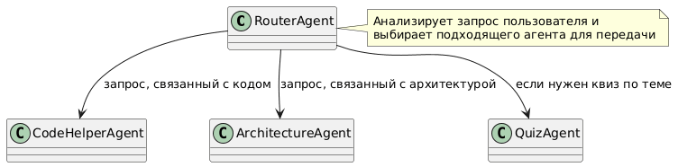

# Multi-Agent Programming Assistant
Система для помощи в программировании. Система помогает анализировать код, объяснять ошибки, предлагать исправлен. Маршрутизатор решает кому передатьуправление. <br>
Рефлексия находится в папке docs.

## Общая информация
### Агенты
1) **Router Agent (маршрутизатор)**
- Классифицирует запрос: *код / архитектура / квиз / смешанный*.
- Решает, какому агенту передать управление.

2) **Code Helper Agent (помощник по коду)**
- Разбирает ошибки, предлагает исправления, пишет/рефакторит функции.
- При необходимости вызывает инструменты: линтер/простая проверка.

3) **Architecture Agent (проектировщик)**
 - Отвечает за проектирование архитектуры.
 - Предлагает структуру модулей, классов, API.
 - После проектирования передаёт управление Code Helper Agent для реализации

 4) **Quiz Agent**
 - Создаёт квиз по непонятной для пользователя теме

 ---
## Паттерн мультиагентной системы
Используемый паттерн:
- **Router + специализированные агенты**
- **Условный переход по графу**
- **Handoff между агентами**
---
## Диаграмма работы системы


 ### Тулы 
 Агенты могут вызывать Python-инструменты:
- **calc(expression: str)** - простые вычисления.
- **read_file(path)** - чтение файлов из папки workspace/ .
- **write_file(path, content)** - запись файлов.
- **save_note(text)** - сохранение заметки в память.
- **search_notes(query)** - поиск по памяти.
- **transfer_to_helper** - передача Code Helper Agent
- **transfer_to_architecture** - передача rchitecture Agent
- **transfer_to_quiz** - передача Quiz Agent
- **list_quizzes** - показывает последние сохранённые квизы (id, тема, сложность, дата, количество вопросов).
- **load_quiz** - загружает квиз целиком по quiz_id (включая вопросы и варианты ответов).
- **grade_quiz** - Проверяет попытку прохождения квиза

Инструменты вызываются только при необходимости и интегрированы через LangChain tools.

### Хранимые данные
- history - история диалога в рамках сессии.
- user_profile - предпочтения пользователя (язык, стек, стиль).
- notes - полезные заметки и решения
- quizzes - созданные квизы по теме 

### Реализация
- Память хранится в memory/notes.json .
- Агенты могут добавлять и извлекать записи.
- Память влияет на последующие ответы.

## Quick Start

### 1. Зависимости
```bash
curl -sSL https://install.python-poetry.org | python3 -
poetry install
```
### 2. Конфигурация Env
```bash
cp example.env .env
```
Или можно вручную создать .env:
```ini
OPENAI_API_BASE=http://localhost:8000/v1
OPENAI_API_KEY=EMPTY
MODEL_NAME='qwen3-32b'
TEMPERATURE=0.3
MAX_TOKENS=2048
MAX_RECURSION_LIMIT=30
MEMORY_PATH=memory/notes.json
WORKSPACE_DIR=workspace
```
### 3. Запуск
Интерактивный режим
```bash
poetry run python src/main.py
```
Демонстрационные эксперименты
```bash
poetry run python demo_experiments.py
```

## Структура проекта
```
programming_assistant/
├── src/
│ ├── main.py # Входная точка 
│ ├── graph.py # описание мультиагентного графа LangGraph, логика маршрутизации и handoff между агентами
│ ├── state.py # описание общего State, передаваемого между агентами
│ ├── agents/
│ │ ├── router.py # агент-маршрутизатор
│ │ ├── code_helper.py # агент-помощник (анализ ошибок, генерация и исправление кода)
│ │ ├── quiz.py # агент, который создаёт квиз по теме
│ │ └── architect.py # агент для проектирования архитектуры
│ ├── prompts/ # промпты для агентов
│ │ ├── router_prompt.md 
│ │ ├── helper_prompt.md 
│ │ ├── architect_prompt.md 
│ │ └── quiz_prompt.md 
│ ├── tools/ # tools для агентов
│ | ├── base_tools.py # набор инструментов для работы агентов (кроме квизного агента и трансферного)
│ | ├── base_tools.py # набор инструментов для работы квизового агента
│ | └── transfer_tools.py # набор инструментов, отвечающих за маршрутизацию
├── docs/
│ ├── image.png # картинка логики архитектуры
│ └── reflection.md # рефлексия по результатам работы и экспериментов
├── memory/
│ ├── quizzes.json # сохранённые квизы
│ └── notes.json # сохранённые заметки и полезный контекст
├── workspace/
├── demo_experiments.py # скрипт с экспериментами и демонстрационными запросами
├── pyproject.toml # зависимости для poetry
└── README.md
```


